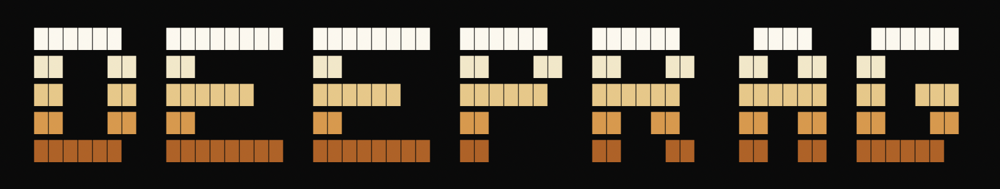

<p align="center">
  
</p>

A bare-metal, from-scratch implementation of Retrieval-Augmented Generation — tracing the full evolution from keyword search to multimodal RAG, with every layer built by hand to understand exactly why it exists.

This whole thing started because I wanted to understand how search actually works and why it evolved the way it did. Every retrieval algorithm exists because the previous one had a flaw. So I traced all of them, from keyword matching to full RAG, building each piece from scratch with no frameworks or magic wrappers.

It starts with keyword search. Just an inverted index, stemming, stopwords, the basics. But plain term matching breaks down when you care about relevance, so you add BM25 scoring to fix that. Then you realize sometimes the words don't match but the meaning does, so you bring in semantic search with embeddings. But now you have two systems that are each good at different things, so you combine them into hybrid search. The scores are on different scales though, so you normalize them, weight them, or use Reciprocal Rank Fusion to merge ranked lists without worrying about score distributions at all.

But your first-pass retrieval is still rough, so you add reranking. You throw a cross-encoder at the top results, or you ask an LLM to judge relevance one-by-one, or you batch the whole thing and let the model sort it out. Each fix introduces its own tradeoffs. Speed vs accuracy, cost vs quality. So you make them all available and mix and match.

Then you realize text isn't everything, so you go multimodal. You use CLIP to project images and text into the same embedding space so you can search your document corpus with a picture. And because your retrieval falls apart when someone types "scifi" instead of "science fiction", you add query enhancement. Spelling correction, query rewriting, query expansion, all powered by an LLM.

Finally you close the loop with generation. You retrieve, you augment, you generate. Summaries, citations, Q&A, the full RAG pipeline end to end. And then you evaluate it: precision, recall, F1 against a golden dataset, plus an LLM judge scoring relevance 0-3.

You can trace the entire evolution from a basic keyword lookup all the way to a full multimodal RAG system with reranking and evaluation, and at each step you can see exactly what problem the next layer solves.

---

## What's In Here

| Layer | What It Does | CLI |
|-------|-------------|-----|
| **Keyword Search** | Inverted index, TF-IDF, full BM25 scoring | `keyword_search_cli.py` |
| **Semantic Search** | Dense embeddings (`all-MiniLM-L6-v2`), cosine similarity, sentence-level chunking | `semantic_search-cli.py` |
| **Hybrid Search** | Weighted combination + Reciprocal Rank Fusion of BM25 and semantic | `hybrid_search_cli.py` |
| **Reranking** | Cross-encoder (`ms-marco-TinyBERT-L2-v2`), LLM individual scoring, LLM batch ranking | via `--rerank-method` flag |
| **Query Enhancement** | Spelling correction, query rewriting, query expansion (Gemini-powered) | via `--enhance` flag |
| **Multimodal Search** | CLIP-based image-to-text search (`clip-ViT-B-32`) | `multimodal_search_cli.py` |
| **RAG Generation** | Retrieve + generate answers, summaries, citations, Q&A | `augmented_generation_cli.py` |
| **Evaluation** | Precision@k, Recall@k, F1@k, LLM judge scoring | `evaluation_cli.py` |

---

## Installation

### Prerequisites

- Python 3.11+
- [uv](https://docs.astral.sh/uv/) (fast Python package manager)

#### Install uv

```bash
# macOS / Linux
curl -LsSf https://astral.sh/uv/install.sh | sh

# or with Homebrew
brew install uv
```

### Quick Setup (Recommended)

```bash
git clone <repo-url>
cd Advanced-rag
uv run cli/setup_cli.py
```

The setup wizard handles everything interactively. It installs dependencies, asks for your Gemini API key, builds the search indexes, embeds document chunks, and runs a demo search to make sure it all works.

### Manual Setup

If you prefer doing it yourself:

```bash
# Clone the repo
git clone <repo-url>
cd Advanced-rag

# Install all dependencies
uv sync
```

This pulls in everything: `sentence-transformers`, `google-genai`, `nltk`, `numpy`, `pillow`, etc.

### Environment Variables

Create a `.env` file in the project root:

```
GEMINI_API_KEY=your_gemini_api_key_here
```

You need a [Google Gemini API key](https://aistudio.google.com/apikey) for query enhancement, reranking with LLM, RAG generation, and evaluation.

### Models

Models are downloaded automatically on first use, no manual setup needed:

- **`all-MiniLM-L6-v2`** for sentence embeddings (384-dim, lightweight)
- **`clip-ViT-B-32`** for multimodal embeddings (shared text-image space)
- **`cross-encoder/ms-marco-TinyBERT-L2-v2`** for reranking

They get cached by HuggingFace after the first download.

---

## Getting Started

### Build the Index (Do This First)

Before any searching works, you need to build the BM25 inverted index:

```bash
uv run cli/keyword_search_cli.py build
```

This processes the movie corpus, stems terms, filters stopwords, and caches the index to disk.

### Verify Everything Is Working

```bash
# Check the embedding model loads
uv run cli/semantic_search-cli.py verifymodel

# Check embeddings are cached
uv run cli/semantic_search-cli.py verifyembeddings
```

---

## Progressive Walkthrough

The whole point of this repo is that each piece builds on the last. Here's the progression, run these in order to see how each layer improves on the previous one:

### 1. Keyword Search (BM25)

```bash
# Basic keyword search
uv run cli/keyword_search_cli.py search "space adventure"

# Full BM25 ranked search
uv run cli/keyword_search_cli.py bm25search "space adventure"

# Inspect the scoring components
uv run cli/keyword_search_cli.py idf "space"
uv run cli/keyword_search_cli.py tfidf 0 "space"
```

### 2. Semantic Search

```bash
# Search by meaning, not just words
uv run cli/semantic_search-cli.py search "a movie about loneliness in outer space"

# Chunked semantic search (sentence-level granularity)
uv run cli/semantic_search-cli.py chunkedsemanticsearch "a movie about loneliness in outer space"
```

### 3. Hybrid Search

```bash
# Weighted hybrid (alpha=0.5 means equal weight BM25 and semantic)
uv run cli/hybrid_search_cli.py weightedsearch "space western" --alpha 0.5 --limit 10

# Reciprocal Rank Fusion
uv run cli/hybrid_search_cli.py rrfsearch "space western" --k 0.5 --limit 5
```

### 4. Query Enhancement + Reranking

```bash
# Fix spelling before searching
uv run cli/hybrid_search_cli.py rrfsearch "scifi moive about robots" --enhance spell --limit 5

# Rewrite the query for better retrieval
uv run cli/hybrid_search_cli.py rrfsearch "that movie where the guy is stuck on mars" --enhance rewrite --limit 5

# Rerank results with a cross-encoder
uv run cli/hybrid_search_cli.py rrfsearch "space western" --rerank-method cross-encoder --limit 5

# Rerank with LLM (individual scoring)
uv run cli/hybrid_search_cli.py rrfsearch "space western" --rerank-method individual --limit 5

# Evaluate results with LLM judge
uv run cli/hybrid_search_cli.py rrfsearch "space western" --evaluate
```

### 5. Multimodal Search

```bash
# Search the movie corpus using an image
uv run cli/multimodal_search_cli.py image_search cli/data/bear.jpg

# Verify image embedding works
uv run cli/multimodal_search_cli.py verify_image_embedding cli/data/bear.jpg
```

### 6. RAG (Retrieval-Augmented Generation)

```bash
# Basic RAG, retrieve and generate an answer
uv run cli/augmented_generation_cli.py rag "what are some good space movies?"

# RAG with summary
uv run cli/augmented_generation_cli.py summarize "best sci-fi movies of all time" --limit 5

# RAG with citations
uv run cli/augmented_generation_cli.py citations "movies about artificial intelligence" --limit 5

# Q&A approach
uv run cli/augmented_generation_cli.py question "recommend a movie like Interstellar" --limit 5
```

### 7. Evaluation

```bash
# Run evaluation against the golden dataset
uv run cli/evaluation_cli.py evaluate --limit 3
```

This computes Precision@k, Recall@k, and F1@k using a curated set of test queries with expected results.

---

## Project Structure

```
Advanced-rag/
├── cli/
│   ├── data/
│   │   ├── data.json              # Movie corpus (5000+ films)
│   │   ├── golden_dataset.json    # Test cases for evaluation
│   │   └── stopwords.txt          # Stopword list
│   ├── cache/                     # Pre-built indexes & embeddings
│   ├── lib/
│   │   ├── keyboard_search.py     # BM25 inverted index
│   │   ├── semantic_search.py     # Embedding-based search
│   │   ├── hybrid_search.py       # BM25 + semantic fusion
│   │   ├── multimodal_search.py   # CLIP image search
│   │   ├── rerank.py              # Reranking methods
│   │   ├── llm.py                 # Gemini integration
│   │   ├── rag.py                 # RAG pipeline
│   │   ├── evaluation.py          # Metrics computation
│   │   └── prompts/               # LLM prompt templates
│   ├── keyword_search_cli.py
│   ├── semantic_search-cli.py
│   ├── hybrid_search_cli.py
│   ├── multimodal_search_cli.py
│   ├── augmented_generation_cli.py
│   ├── evaluation_cli.py
│   └── describe_image_cli.py
└── pyproject.toml
```

---

## How It All Fits Together

```
Query → [Enhancement] → [BM25 + Semantic] → [Fusion] → [Reranking] → [Generation] → Answer
         spelling         keyword    embed    weighted    cross-encoder   summarize
         rewrite          tf-idf     cosine   RRF         LLM judge       cite
         expand           BM25       chunk                batch LLM       Q&A
```

Each arrow is optional. You can use just BM25. You can skip reranking. You can skip generation and just retrieve. The pieces are modular, mix and match based on what you're trying to do.
